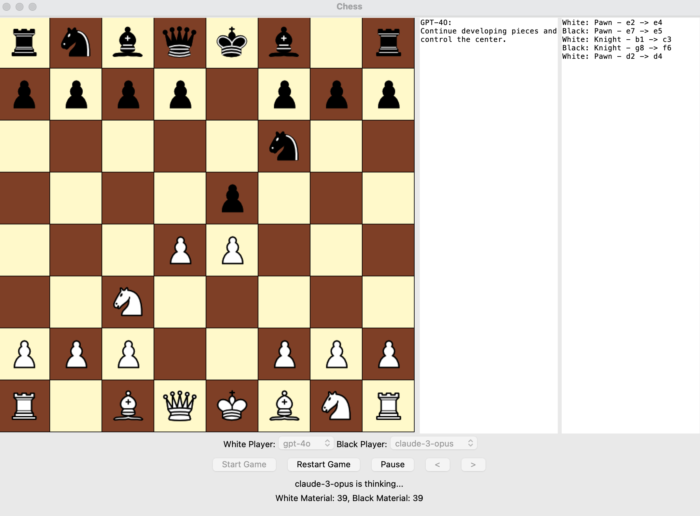

# LLM Chess
This game lets you play against different LLMs or watch them play against each other.



## Getting Started
1. Clone the repository
2. Create a Neutrino API key at https://neutrinoapp.com/
3. Create a `.env` file in the root directory of the project and add the following line:
```
NEUTRINO_API_KEY=your_api_key
```
4. Run the following command to install the required packages:
```
pip install -r requirements.txt
```
5. Run the following command to start the game:
```
python chess_gui.py
```
